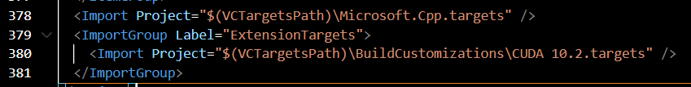
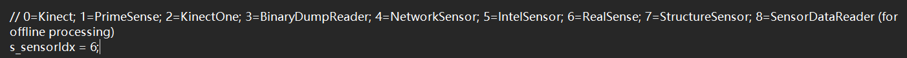
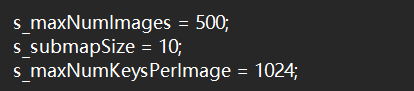
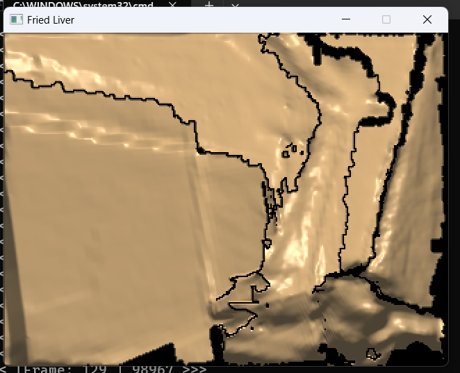
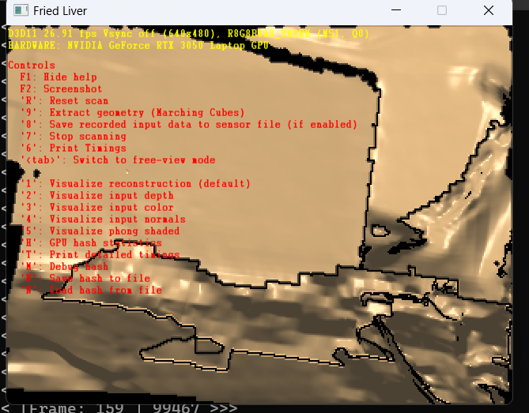
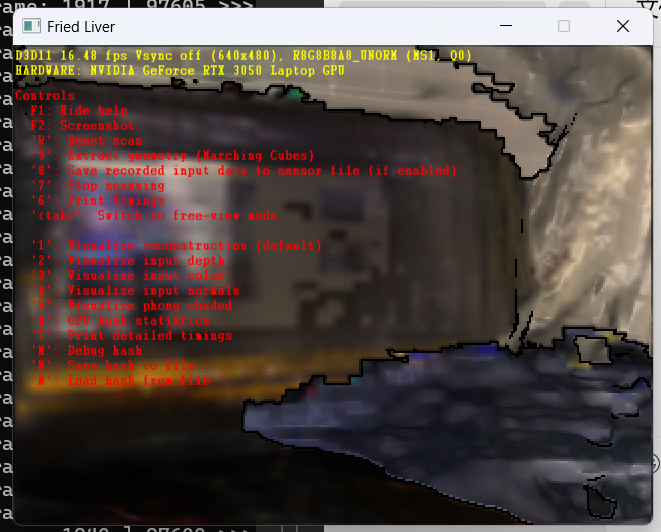
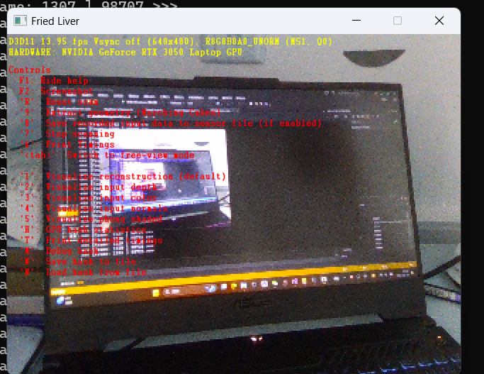
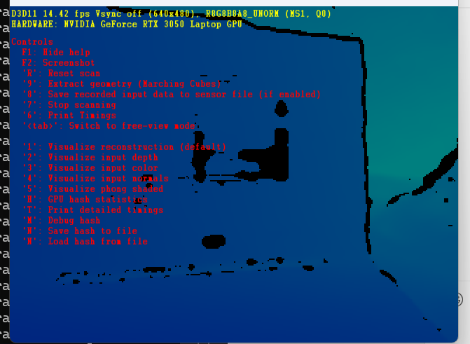

# BundleFusion

## 一、环境配置 
>操作系统：win11 x64 
>集成平台：Visual Studio 2013（尚未尝试其他版本是否可行） 
>计算架构：cuda10.2 
>开发工具：DXSDK_Jun10 
>深度相机：Intel RealSense D435 
>显卡：NVIDIA GeForce RTX3050(官方采用NVIDIA GeForce 950MX，只要计算能力达到5.0即可) 
## 二、项目配置 
1、mLib external文件夹在本项目的main分支，下载后解压并放在BundleFusion同级目录 
2、修改cuda版本,如果cuda不是10.2版本，可以打开BundleFusion-master\FriedLiver\FriedLiver.vcxproj 文件，把CUDA 10.2.targets部分修改为当前CUDA版本 

## 三、实时三维重建 
编译代码，会在BundleFusion\FriedLiver\x64\Release目录下生成Friedliver.exe文件，可以直接点击运行，也可以在vs2013中点击“开始执行”来运行，但运行前要修改对应目录下的zParametersBundlingDefault.txt 和 zParametersDefault.txt文件，前者在BundleFusion\FriedLiver\x64\Release目录下，后者在BundleFusion\FriedLiver目录下，主要关注的点有： 
1、将数据来源设置为直接从相机获取，在zParametersDefault.txt文件中令s_sensorIdx = 6： 
 
2、设置最多可以接收的图像数量，默认为500*10=5000张，可以在zParametersBundlingDefault.txt文件中适当调整 
 
运行后会生成一个窗口，可以看到实时重建效果，默认不显示色彩: 
 
按tab键可以查看可以执行的功能，比如按“2”可以查看实时重建的彩色效果，按“3”是查看RGB图像，按“4”是查看深度图像，按“9”是保存重建的点云，也可直接按ctrl+9保存点云,点云会保存在BuddleFusion\FriedLiver\scans目录下： 
查看窗口功能
查看彩色重建效果
查看RGB图像流
查看深度图像流
可以移动摄像头来不断更新重建点云，正常跟踪的时候窗口是黄色的，丧失跟踪后窗口会变成灰色，这时需要回到之前正常跟踪的位置让窗口重新变成黄色 
