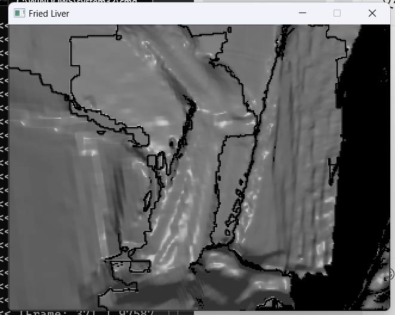
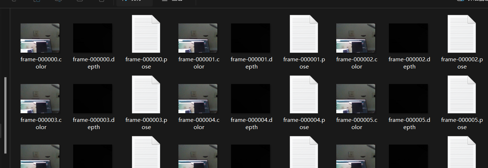
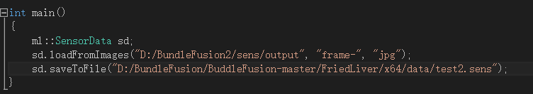
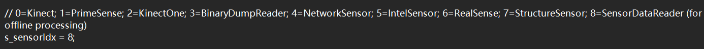

# BundleFusion

## 一、环境配置 
>操作系统：win11 x64 
>集成平台：Visual Studio 2013（尚未尝试其他版本是否可行） 
>计算架构：cuda10.2 
>开发工具：DXSDK_Jun10 
>深度相机：Intel RealSense D435 
>显卡：NVIDIA GeForce RTX3050(官方采用NVIDIA GeForce 950MX，只要计算能力达到5.0即可) 
## 二、项目配置 
1、mLib external文件夹在本项目的main分支，下载后解压并放在BundleFusion同级目录 
2、修改cuda版本,如果cuda不是10.2版本，可以打开BundleFusion-master\FriedLiver\FriedLiver.vcxproj 文件，把CUDA 10.2.targets部分修改为当前CUDA版本 

## 三、实时三维重建 
编译代码，会在BundleFusion\FriedLiver\x64\Release目录下生成Friedliver.exe文件，可以直接点击运行，也可以在vs2013中点击“开始执行”来运行，但运行前要修改对应目录下的zParametersBundlingDefault.txt 和 zParametersDefault.txt文件，前者在BundleFusion\FriedLiver\x64\Release目录下，后者在BundleFusion\FriedLiver目录下，主要关注的点有： 
1、将数据来源设置为直接从相机获取，在zParametersDefault.txt文件中令s_sensorIdx = 6： 
 
2、设置最多可以接收的图像数量，默认为500*10=5000张，可以在zParametersBundlingDefault.txt文件中适当调整 
 
运行后会生成一个窗口，可以看到实时重建效果，默认不显示色彩: 
 
按tab键可以查看可以执行的功能，比如按“2”可以查看实时重建的彩色效果，按“3”是查看RGB图像，按“4”是查看深度图像，按“9”是保存重建的点云，也可直接按ctrl+9保存点云,点云会保存在BundleFusion\FriedLiver\x64\Release\scans或者BuddleFusion\FriedLiver\scans目录下： 
查看窗口功能 
 
查看彩色重建效果 
 
查看RGB图像流 
 
查看深度图像流 
 
可以移动摄像头来不断更新重建点云，正常跟踪的时候窗口是黄色的，丧失跟踪后窗口会变成灰色，这时需要回到之前正常跟踪的位置让窗口重新变成黄色 
 
## 四、离线三维重建
### 1、数据采集
打开项目中的“拍摄脚本2.py”文件，修改保存文件的路径（空文件夹），连接相机，运行代码，按c开始采集深度图像信息和RGB图像信息，按q退出,将BundleFusion\路径下的info.txt文件复制到图像流所在的文件夹中，并将info.txt中的m_frames.size 按照实际采集的frame数量进行设置 
 
此时的数据还是图像流，但离线重建的源数据是.sens文件，而本项目在实时重建的过程中其实完成了对.sens的封装，只需提取出其中的实现.sens封装的部分。所以拷贝一份本项目代码做修改，用于专门用于.sens文件，称为项目2，将项目2的BundleFusion\FriedLiver\Source中的Friedliver.cpp文件替换成BundleFusion\路径下的Friedliver.cpp文件，再将BundleFusionexternal\mLib\include\ext-depthcamera中的sensordata.h文件替换成BundleFusion\路径下的sensordata.h文件,打开替换后的Friedliver.cpp文件，修改“sd.loadFromImages("D:/BundleFusion2/sens/output", "frame-", "jpg")；”中的路径为图像流所在的文件夹，修改”sd.saveToFile("D:/BundleFusion/BuddleFusion-master/FriedLiver/x64/data/test2.sens");”的路径为拟保存.sens文件的实际路径。 
 
随后运行项目2，即可将数据流封装为 .sens 格式。提示“done”即为封装成功。至此，项目2的任务已经完全结束了，后面的工作再次围绕原项目展开 
### 2、离线重建
将数据来源设置成离线数据，即确保zParametersDefault.txt中s_sensorIdx = 8; 
 
将zParametersDefault.txt中第58行的路径改为上面保存.sens文件的实际路径 
 
运行代码，即可完成离线重建，离线重建的过程中也会有窗口提示重建的过程，重建完成后，点云会保存至BundleFusion\FriedLiver\x64\data路径下
